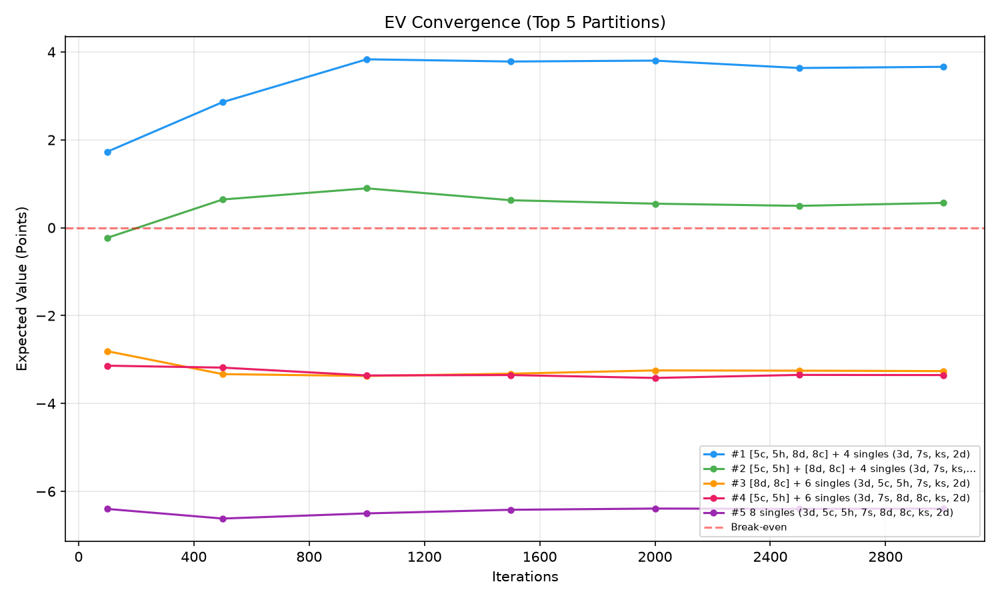

# Week 4-5

## Big 2 Cards Combinations (or partitions)

Cards are tuples: `(value, suit)`

**Values** (lowest to highest): `3, 4, 5, 6, 7, 8, 9, 10, j, q, k, a, 2`
- Integer mapping: `3-10` → 3-10, `j`→11, `q`→12, `k`→13, `a`→14, `2`→15

**Suits** (lowest to highest): `d` (diamonds) < `c` (clubs) < `h` (hearts) < `s` (spades)

Example: `('3', 'd')` = 3 of Diamonds, `('a', 's')` = Ace of Spades

Big 2 card combination type

| Type | Cards | Description |
|------|-------|-------------|
| SINGLE | 1 | Any card |
| PAIR | 2 | Same rank |
| TRIPLE | 3 | Same rank |
| TWO_PAIR | 4 | Two distinct pairs |
| STRAIGHT | 5 | 5 consecutive, mixed suits |
| FLUSH | 5 | Same suit |
| FULL_HOUSE | 5 | Triple + pair |
| FOUR_OF_A_KIND | 5 | Quad + kicker |
| STRAIGHT_FLUSH | 5 | Consecutive + same suit |

code reference: 
- [game_rule.py](../code/monte-carlos-analysis/game_rule.py)
- [patition_finder.py](../code/monte-carlos-analysis/partition_finder.py)

## The Design of a Monte Carlo Simulation for Big 2 

The primary goal of this project is to utilize a Monte Carlo simulation framework to evaluate starting hand combinations in Big 2 and determine optimal card arrangement strategies that maximize expected value.

Monte Carlo simulations rely heavily on the design of the simulation environment. In a real-world scenario, modeling every single variable of a Big 2 game is computationally prohibitive due to imperfect information constraints, vast card permutations, and diverse player behaviors. To ensure a highly feasible and optimized computing workload, this simulation engine isolates key impactful variables while standardizing or fixing environmental factors to simplify the broader game tree.

***

### Key Simulation Assumptions & Constraints

*   **Homogeneous Player Strategy:** To eliminate extreme variance caused by psychological gameplay, all players operate under an identical heuristic decision algorithm. The baseline strategy prioritizes playing lower-value cards first, grouping valid combinations efficiently, reserving high-value cards (2s) to maintain round control, and aggressively rushing to empty the hand when close to victory.
  
*   **Optimized Hand Size:** The starting card count per player is structurally scaled down from 13 cards to **8 cards**. This constraint drastically reduces the computational overhead and processing time per iteration while fully preserving core game mechanics.

*   **Deterministic vs. Stochastic Setup:** The primary player's 8-card hand configuration remains entirely **fixed** across a single simulation batch. To accurately evaluate the baseline win expectancy of that specific hand structure, the remaining deck is stochastically and randomly distributed among the opponents over thousands of independent iterative runs.

## Big 2 game engine

The core game loop runs like this:

1. Find the starting player — whoever holds the 3 of diamonds goes first. If no one has 3d, a random player is chosen.
2. Each turn, the current player uses `choose_move_constrained()` to decide their action:
   - If they hold 3d on the first round, they must play SINGLE(3d) first (game rule override)
   - If leading (no current play), they play the first combo from their remaining partition
   - If beating (must match a play), they scan all remaining partition combos for valid ones and use SmartAI scoring to pick the best
   - If no valid partition combo exists, they pass
3. When a player plays, the cards are removed from their hand, the played combo is removed from their partition, the current_play is updated, and the pass counter resets to zero.
4. When a player passes, the pass counter increments. When it reaches 3 (meaning everyone else passed), the round is over. The last player who actually played cards becomes the new round leader and can lead any play they want. The pass counter resets.
5. The game ends when any player has zero cards left — that player wins. If 200 turns pass with no winner, the game stops and reports no winner.
6. The result returned is the winner's index and the number of cards remaining in each player's hand at game end.

code reference: 
- [big2_game.py](../code/monte-carlos-analysis/big2_game.py)

## AI Player

AI players evaluate all valid moves and score each one. When leading, they prioritize playing low cards first, grouping cards into combos, and saving 2s. When beating an opponent's play, they pick the cheapest card that still wins, avoiding high cards unless necessary. Near the end (3 cards left), they rush to go out. The lowest-scoring move is always chosen.

In the simulation, all 4 players (including Player 0) use the same system:
1. Each player gets a partition strategy (grouping of their cards)
2. When it's their turn, they check if any remaining partition combo can be played
3. If leading, they play the first combo from their remaining partition
4. If beating, they scan all remaining partition combos for valid ones and pick the best using SmartAI scoring
5. If no valid partition combo exists, they pass
6. When a combo is played, it's removed from their remaining list
7. The 3d override: on the first round, if a player holds 3d, they must play SINGLE(3d) first (game rule)

The codebase has two AI modes:

***SmartAI*** — Strategic opponent. Scores every valid move and picks the lowest-scoring one. Plays low cards first, groups combos when efficient, saves 2s for control, and rushes to go out when close to winning.

***RandomAI*** — Chaotic opponent. Picks a completely random valid move with no strategy. Useful as a baseline to test how much better SmartAI performs.

- [AI player explanation](../code/monte-carlos-analysis/smart-ai.md)
- [big2_ai.py](../code/monte-carlos-analysis/big2_ai.py)

## Expected value (EV) of big 2 game

In economic theory, Expected Value is the probability-weighted average of all possible outcomes. In Big 2, points matter. Therefore, your simulation's true Expected Value should be measured in Expected Points Won or Lost per Hand.

$$
EV = \frac{1}{N} \sum_{i=1}^{N} P_{i}
$$

*   **$N$** = Total number of simulated games (e.g., 3,000)
*   **$P_{i}$** = The net score of game $i$.
    *   If you win, $P_{i}$ is a **positive number** (the sum of cards left in your opponents' hands).
    *   If you lose, $P_{i}$ is a **negative number** (the number of cards left in your hand, factored by double penalties).

Example 1
- You win 40% of the time (+13 points from opponents).
- You lose 60% of the time, but because your hand is fragile, you get blocked and caught with 10 cards (2× double point penalty = -20 points).
- Win Rate: 40%
- Expected Value (Points): \((0.40 x 13) + (0.60 x -20) = 5.2 - 12.0 = -6.8 points

Example 2
- You win only 35% of the time (+13 points).
- You lose 65% of the time, but because your hand is flexible, you always empty most of your cards, leaving only 2 cards left when the winner finishes (-2 points).
- Win Rate: 35%
- Expected Value (Points): \((0.35 x 13) + (0.65 x -2) = 4.55 - 1.3 = +3.25 points

**Note:** This Expected Value formula is a simplified model. In a standard Big 2 game, the penalty system scales non-linearly; holding more cards at the end of a round increases point losses exponentially due to double and triple point penalties.

Evaluating game outcomes solely through absolute win rates is insufficient, as the residual cards remaining in a player's hand introduce significant volatility and risk. Consequently, the Expected Value (EV) framework is deployed to calculate the probability-weighted average of these point spreads. In economic theory, this methodology directly mirrors the principles of maximizing expected utility and mitigating downside tail-risk.

## Design of Monte Carlo simulation

The [sim_play.py](../code/monte-carlos-analysis/sim_play.py) python script runs a Monte Carlo convergence analysis to determine which partition strategy maximizes expected value for a given hand.

### Simulation Pipeline

1. **Fixed hand input** — The player's hand is fixed across all iterations. Current test hand: `[3d, 5h, 5c, 7s, ks, 8d, 8c, 2d]` (8 cards with a pair of 5s, a pair of 8s, and a 2).

2. **Partition enumeration** — The engine finds every valid way to group the hand into legal Big 2 plays. For the current hand, this produces top 5 distinct partitions:
   - `[5c,5h,8d,8c] + 4 singles` — play four-of-a-kind first, then singles
   - `[5c,5h] + [8d,8c] + 4 singles` — play pairs separately, then singles
   - `[5c,5h] + 6 singles` — play one pair first, then singles
   - `[8d,8c] + 6 singles` — play the other pair first, then singles
   - `8 singles` — play every card individually

3. **Stochastic opponent generation** — For each simulation, the remaining 24 cards are randomly dealt to 3 opponents (8 cards each). Each opponent also receives a random partition from their hand, ensuring all players use structured strategies rather than arbitrary play.

4. **Full game simulation** — All 4 players use SmartAI with constrained partitions:
   - **3d override**: On the first round, whoever holds 3d must play it first
   - **Leading**: Play the first combo from remaining partition
   - **Beating**: Scan all remaining partition combos for valid moves, pick best using SmartAI scoring
   - **No valid combo**: Pass

5. **Milestone tracking** — Records three metrics at 100, 500, 1000, 1500, 2000, 2500, and 3000 iterations:
   - **Win Rate**: Percentage of games won
   - **Average Cards Left**: Mean cards remaining when game ends
   - **Expected Value (EV)**: Probability-weighted points per hand
     - Win: $P_i = \sum_{j=1}^{3} cards\_left[j]$ (sum of opponents' remaining cards)
     - Lose: $P_i = -2 \times cards\_left[0]$ (double penalty on your remaining cards)

6. **Ranking and visualization** — Partitions are sorted by final EV (descending), top 5 are selected, and 4 graphs are generated showing convergence and final comparison.

### Analysis of Monte Carlo simulation Result

Running 3,000 iterations per partition (5 partitions × 3,000 = 15,000 total games, ~34 seconds) reveals clear strategic hierarchy:

| Rank | Partition | Win Rate | Avg Cards Left | EV |
|------|-----------|----------|----------------|-------|
| 1 | `[5c,5h,8d,8c] + 4 singles` | **52.6%** | 1.98 | **+3.66** |
| 2 | `[5c,5h] + [8d,8c] + 4 singles` | 38.3% | 2.14 | +0.56 |
| 3 | `[8d,8c] + 6 singles` | 14.3% | 2.31 | -3.26 |
| 4 | `[5c,5h] + 6 singles` | 15.3% | 2.40 | -3.35 |
| 5 | `8 singles` | 1.4% | 3.27 | -6.39 |

Four key pieces of evidence prove the Monte Carlo method works:

**1. Convergence stabilizes** — The win rate graphs show lines that start noisy at 100 iterations but flatten out by 1500-2000 iterations. For example, the #1 partition's win reate oscillates between 45% and 53% in the first 1000 iterations, then stabilizes at ~52.6% by 1500+ iterations. This proves the simulation results are statistically reliable - running more simulations doesn't change the ranking, it only reduce noise. 

**2. Avg cards left validates win rate** — The top partition leaves only 1.98 cards on average, while the worst leaves 3.27. This dual metric agreement proves the Monte Carlo method is measuring real strategic advantage, not just variance in random opponent hands. A strategy that wins more often also empties its hand more efficiently.

**3. EV convergence shows profitability** — The EV chart plots expected points per hand against iteration count, with a red break-even line at 0. The top 2 partitions converge to positive EV (+3.66 and +0.56), meaning they are profitable long-term strategies. The bottom 3 converge to negative EV, confirming they are losing strategies regardless of iteration count. This is the most critical insight — win rate alone doesn't tell you if a strategy actually earns points.

**4. Clear EV ranking emerges** — The final ranking bar chart uses green bars for positive EV and red bars for negative EV, making profitability immediately visible. The gap between #1 (+3.66) and #2 (+0.56) is 3.1 points per hand — a massive difference over hundreds of games. The drop from #2 to #3 (+0.56 to -3.26) shows that breaking up the quad into separate pairs costs 3.8 points per hand on average.

### Strategic Insights from the Data

**Holding a 2 is transformative** — If player holds other card (same cards but `8h` instead of `2d`), where all 14 partitions had negative EV (worst: -9.31, best: -6.27), the current hand with `2d` achieves +3.66 EV. A single 2 shifts the top strategy by over 10 points per hand.

**Quad > Two pairs > One pair > All singles** — The ranking is unambiguous:
- Playing `[5c,5h,8d,8c]` as a four-of-a-kind wins 52.6% of games (EV +3.66)
- Playing the pairs separately wins 38.3% (EV +0.56)
- Playing just one pair wins ~15% (EV ~-3.3)
- Playing all singles wins 1.4% (EV -6.39)

The lesson: **consolidate into the largest valid combination first**. The quad play clears 4 cards in one turn, gains the lead immediately, and lets you control the game with your remaining high cards and the 2.

## Takeaway

Monte Carlo simulation works because it explores all possible opponent hand combinations against each partition strategy. Instead of guessing which card grouping is best, you simulate thousands of realistic game scenarios and let the data reveal the winner.

The convergence graphs prove the estimates are stable, and the **Expected Value (EV) framework** provides a superior, risk-adjusted economic measure of strategy utility. It shifts the evaluation metric away from a primitive, binary win/loss rate toward a precise calculation of expected net returns—quantifying not merely the raw probability of victory, but the average point margin captured (or lost) per hand across all possible market states.

