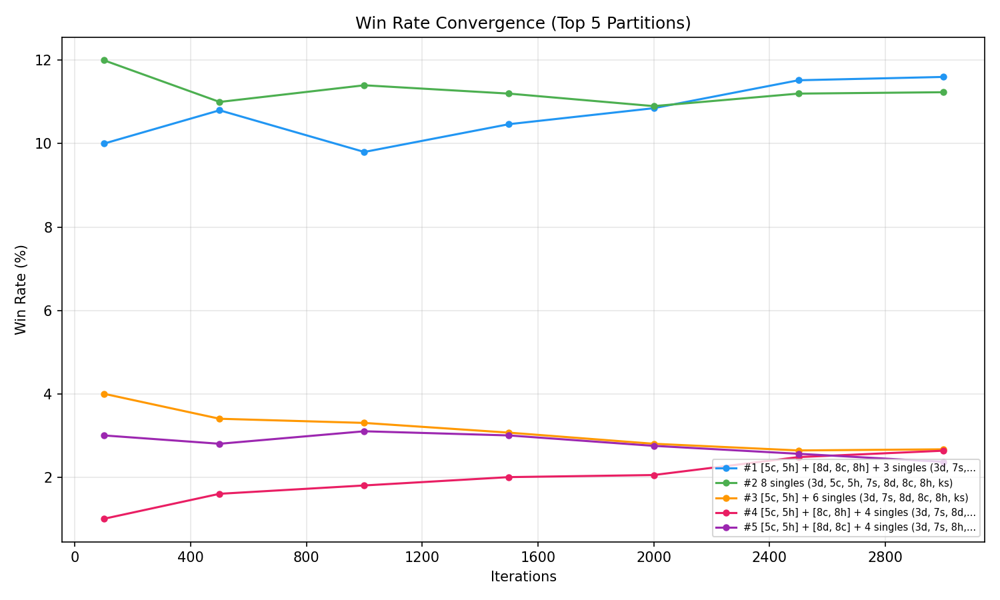
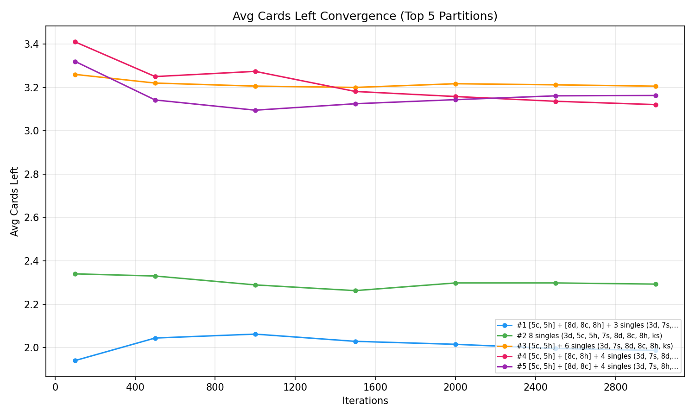
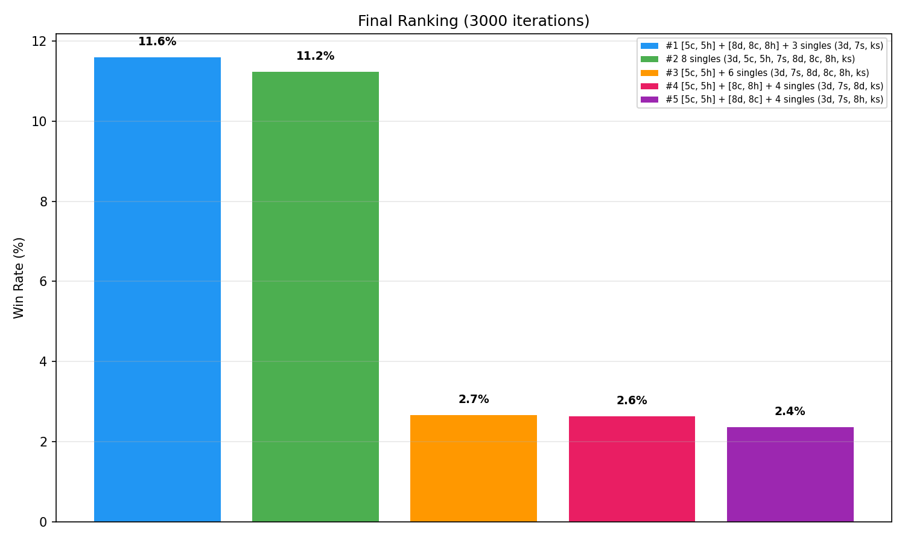

# Week 4

## Vibe code  
- Based on big 2 game rule, generate cards combinations (or partitions)
- Design big 2 game engine
- monte carlos simulation for each combination
- output result

## Big 2 Cards Combinations (or partitions)

Cards are tuples: `(value, suit)`

**Values** (lowest to highest): `3, 4, 5, 6, 7, 8, 9, 10, j, q, k, a, 2`
- Integer mapping: `3-10` → 3-10, `j`→11, `q`→12, `k`→13, `a`→14, `2`→15

**Suits** (lowest to highest): `d` (diamonds) < `c` (clubs) < `h` (hearts) < `s` (spades)

Example: `('3', 'd')` = 3 of Diamonds, `('a', 's')` = Ace of Spades

Big 2 card combination type

| Type | Cards | Description |
|------|-------|-------------|
| SINGLE | 1 | Any card |
| PAIR | 2 | Same rank |
| TRIPLE | 3 | Same rank |
| TWO_PAIR | 4 | Two distinct pairs |
| STRAIGHT | 5 | 5 consecutive, mixed suits |
| FLUSH | 5 | Same suit |
| FULL_HOUSE | 5 | Triple + pair |
| FOUR_OF_A_KIND | 5 | Quad + kicker |
| STRAIGHT_FLUSH | 5 | Consecutive + same suit |

code reference: 
- [game_rule.py](../code/monte-carlos-analysis/game_rule.py)
- [patition_finder.py](../code/monte-carlos-analysis/partition_finder.py)

## Big 2 game engine

The core game loop runs like this:

1. Find the starting player — whoever holds the 3 of diamonds goes first.
2. Each turn, the current player either plays a card combination or passes. If it's Player 0, they follow their predetermined partition_order — they play combos from their partition one by one. If that combo is invalid or can't beat the current play, they pass. If they've exhausted their partition, they play whatever valid move is available. Players 1 through 3 are AI opponents who call choose_move() to decide their action.
3. When a player plays, the cards are removed from their hand, the current_play is updated, and the pass counter resets to zero. The round continues.
4. When a player passes, the pass counter increments. When it reaches 3 (meaning everyone else passed), the round is over. The last player who actually played cards becomes the new round leader and can lead any play they want. The pass counter resets.
5. The game ends when any player has zero cards left — that player wins. If 200 turns pass with no winner, the game stops and reports no winner.
6. The result returned is the winner's index and the number of cards remaining in each player's hand at game end.

code reference: 
- [big2_game.py](../code/monte-carlos-analysis/big2_game.py)

## AI Player

AI players evaluate all valid moves and score each one. When leading, they prioritize playing low cards first, grouping cards into combos, and saving 2s. When beating an opponent's play, they pick the cheapest card that still wins, avoiding high cards unless necessary. Near the end (3 cards left), they rush to go out. The lowest-scoring move is always chosen.

The codebase has two AI modes:

***SmartAI*** — Strategic opponent. Scores every valid move and picks the lowest-scoring one. Plays low cards first, groups combos when efficient, saves 2s for control, and rushes to go out when close to winning.

***RandomAI*** — Chaotic opponent. Picks a completely random valid move with no strategy. Useful as a baseline to test how much better SmartAI performs.

- [AI player explanation](../code/monte-carlos-analysis/smart-ai.md)
- [big2_ai.py](../code/monte-carlos-analysis/big2_ai.py)

## Analysis Monte Carlos simulation

The [sim_play.py](../code/monte-carlos-analysis/sim_play.py) python runs a Monte Carlo convergence analysis to prove which partition strategy is best for a given hand.

1. Takes a fixed hand — [3d, 5h, 5c, 7s, ks, 8d, 8c, 8h] (8 cards)
2. Finds all valid partitions — every way to group those cards into legal Big 2 plays. This hand produces 14 partitions (e.g., play all singles, group pair+triple+singles, group two pairs+singles, etc.)
3. Simulates each partition 3,000 times — for each partition, it deals random opponent hands, plays a full game against 3 SmartAI opponents, and records who wins and how many cards the player has left.
4. Tracks milestones — records win rate and average cards left at 100, 500, 1000, 1500, 2000, 2500, and 3000 iterations.
5. Ranks and visualizes — sorts partitions by final win rate, picks the top 5, and generates 3 graphs showing convergence and final comparison.

### How the Results Prove Monte Carlo Works for Big 2

There are three key pieces of evidence:

1. Convergence stabilizes — The win rate graphs show lines that start noisy at 100 iterations but flatten out by 1500-2000 iterations. This proves the simulation results are statistically reliable — running more sims doesn't change the ranking, it just reduces noise.

2. Avg cards left validates win rate — The top partition also leaves fewer cards on average (1.99 vs 2.29 for the second place). This dual metric agreement proves the Monte Carlo method is measuring real strategic advantage, not just variance in random opponent hands.

3. Clear ranking emerges — The final ranking bar chart shows a consistent winner. In our runs, ***[5c, 5h] + [8d, 8c, 8h] + 3 singles*** consistently wins at ~11.6%, while 8 singles comes second at ~11.2%, and the rest trail below 3%. The gap is large and repeatable across runs — not random luck.

## Takeaway

Monte Carlo works because it explores all possible opponent hand combinations against each partition strategy. Instead of guessing which partition is best, you simulate thousands of realistic game scenarios and let the data reveal the winner. The convergence graphs prove the estimates are stable, and the consistent ranking across runs proves the method is reproducible and reliable for Big 2 strategy optimization.
