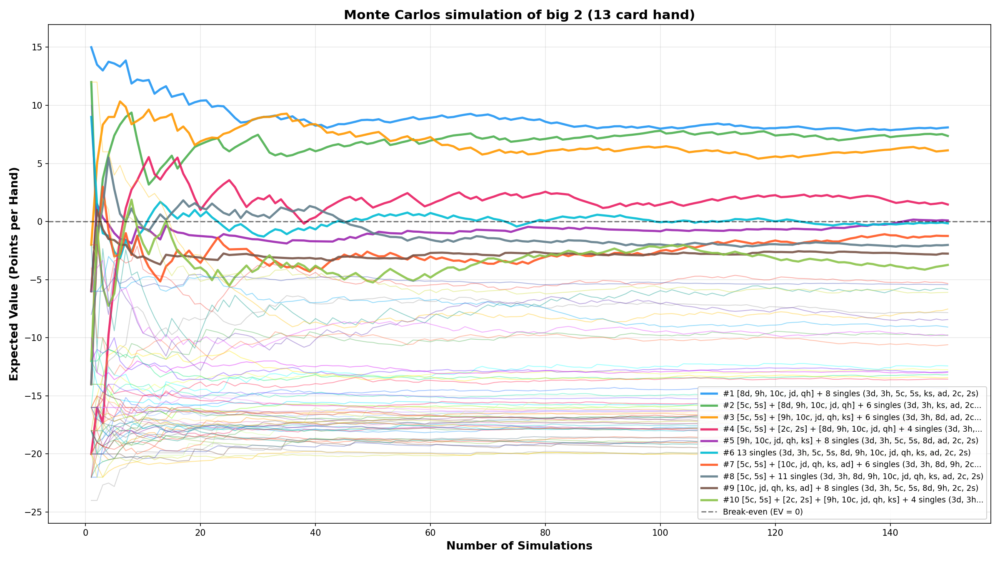
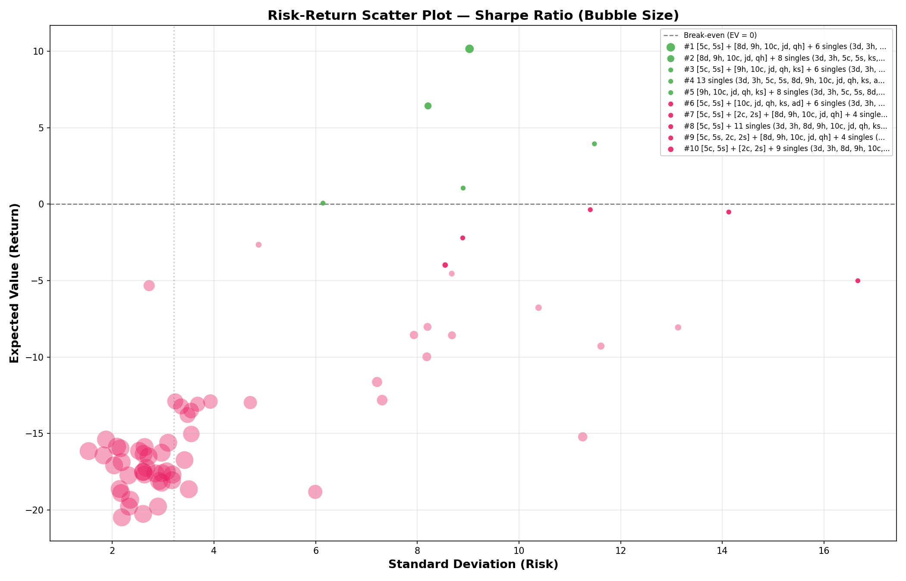
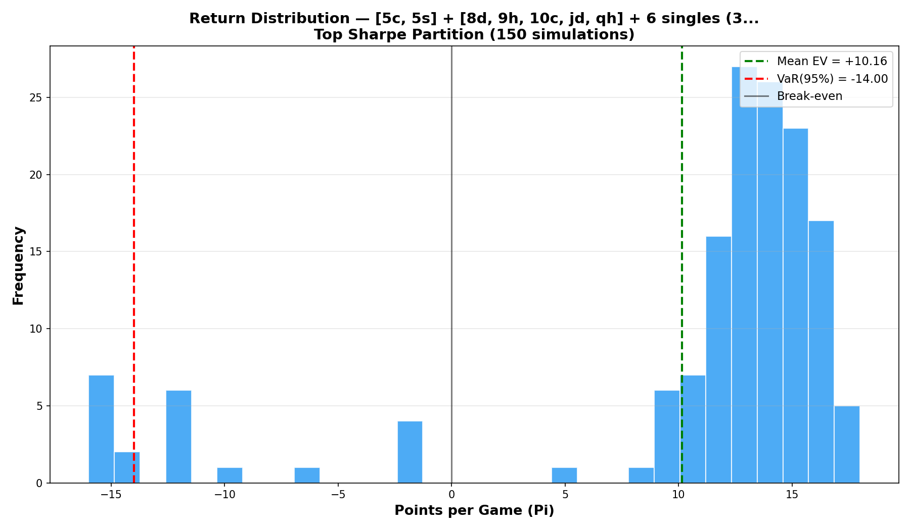
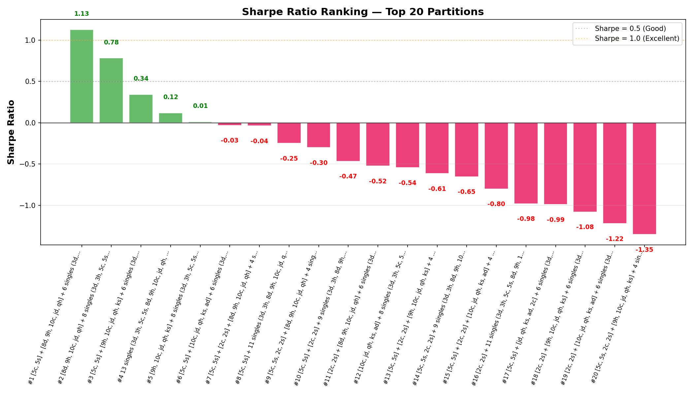

# Financial Analysis — Big 2 Monte Carlo Simulation

## Overview

Monte Carlo simulation framework for evaluating Big 2 starting hand combinations and determining optimal card arrangement strategies that maximize Expected Value (EV) and risk-adjusted returns.

### What is Expected Value (EV)?

EV measures the probability-weighted average of points won or lost per hand:

- **Win**: You gain points equal to the sum of opponents' remaining cards
- **Lose**: You lose points = `-2 × your remaining cards` (double penalty)

**Positive EV** means the strategy is profitable long-term. **Negative EV** means it loses points on average.

## Interpreting Combined Metrics

Each metric answers a different question. Use them together for optimal strategy selection:

| Metric | Answers | Decision Rule |
|--------|---------|---------------|
| **EV** | "Am I profitable long-term?" | Positive = worth playing |
| **VaR(95%)** | "How bad can it get?" | Closer to 0 = lower downside risk |
| **Sharpe** | "Is the return worth the risk?" | Higher = better risk-adjusted return |

### Sharpe Ratio Benchmarks

| Sharpe | Rating | Action |
|--------|--------|--------|
| > 1.0 | Excellent | Play confidently — high return, efficient risk |
| 0.5 – 1.0 | Good | Play with proper bankroll management |
| 0 – 0.5 | Marginal | Only play if no better option exists |
| < 0 | Losing | Avoid — negative return per unit of risk |

### Example from Simulation Results

| Rank | Partition | EV | VaR(95%) | Sharpe | Interpretation |
|------|-----------|------|----------|--------|----------------|
| 1 | `[5c,5s] + [8d,9h,10c,jd,qh] + 6 singles` | +10.16 | -14.00 | **+1.13** | **Best overall** — high return, excellent Sharpe despite moderate tail risk |
| 2 | `[8d,9h,10c,jd,qh] + 8 singles` | +6.43 | **-6.00** | +0.78 | **Safest** — lowest downside, good for conservative play |
| 3 | `[5c,5s] + [9h,10c,jd,qh,ks] + 6 singles` | +3.95 | -14.00 | +0.34 | **Marginal** — barely beats risk, consider alternatives |
| 4 | `13 singles` | +1.05 | -12.00 | +0.12 | **Barely profitable** — essentially breakeven |

### VaR Interpretation

- **VaR(95%) = -6** → 95% of games, you lose no more than 6 points
- **VaR(95%) = -24** → 5% of games, you lose more than 24 points (catastrophic tail risk)
- VaR close to 0 = limited downside even in bad scenarios

### Decision Framework

1. **Filter by EV > 0** — eliminate all losing strategies
2. **Check VaR(95%)** — can your bankroll survive worst-case 5% scenarios?
3. **Pick highest Sharpe** — among viable options, maximize risk-adjusted return

## How It Works

1. **Partition Enumeration** — Finds every valid way to group the 13-card hand into legal Big 2 plays (e.g., pairs, straights, singles)
2. **Simulation Loop** — For each partition:
   - Deals 8 random cards to 3 opponents
   - Runs `TOTAL_SIMS` full games with all players using SmartAI
   - Records each game's point outcome (Pi)
3. **Ranking** — Sorts partitions by EV or Sharpe Ratio (descending)
4. **Visualization** — Generates convergence curves, scatter plots, histograms, and bar charts

## Output

### EV Convergence [ev_convergence.py](../code/financial-analysis/ev_convergence.py)

- **Console**: Ranked summary table with Win Rate, Avg Cards Left, and EV
- **Graph**: `ev_convergence_all.png` — EV convergence lines for all partitions with top 10 highlighted

### Risk Analysis [risk_analysis.py](../code/financial-analysis/risk_analysis.py)

- **Console**: Ranked summary table with EV, Std Dev, VaR(95%), and Sharpe Ratio
- **Graphs**:
  - `risk_return_scatter.png` — Risk (Std Dev) vs Return (EV) scatter plot, bubble size = Sharpe Ratio
  
  - `risk_histogram.png` — Return distribution histogram for the top Sharpe partition with VaR marker
  
  - `sharpe_bar_chart.png` — Sharpe Ratio ranking bar chart for top 20 partitions
  
